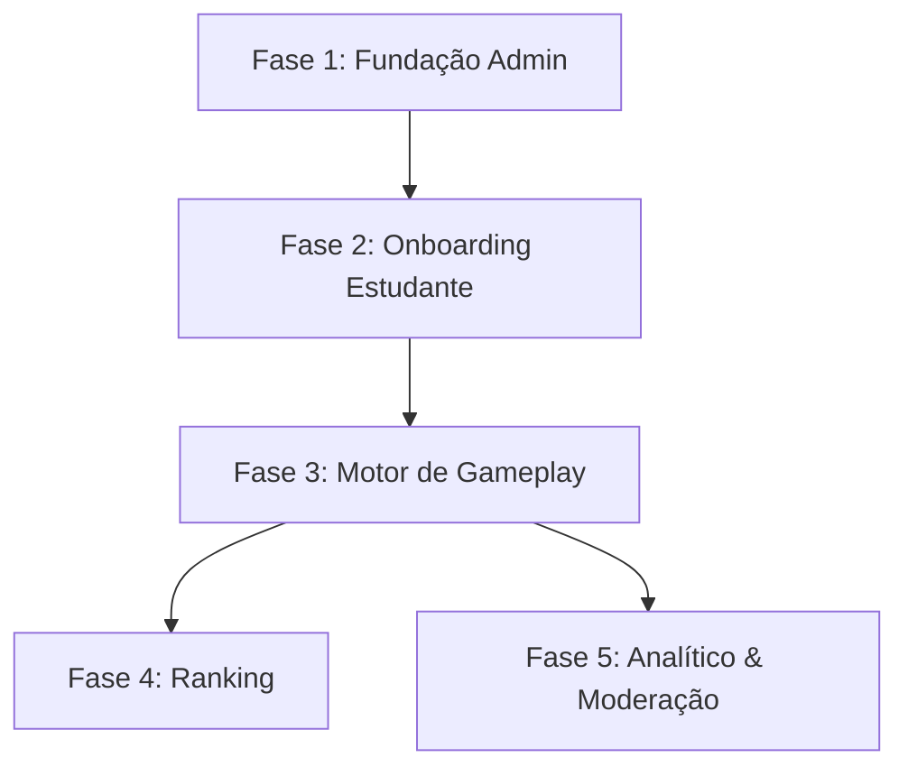

# Roadmap: Plataforma Gamificada de Direito Ambiental

## Visão Geral
Plano de implementação dividido em 5 fases sequenciais, visando o lançamento de um MVP em 1 mês. A estratégia prioriza a criação do acervo de conteúdo pelos administradores antes de habilitar a jornada de aprendizado gamificado para os estudantes.

## Fase 1: Fundação & Gestão de Conteúdo (Admin)
- **Objetivo:** Estabelecer as bases da plataforma e fornecer as ferramentas para que os administradores cadastrem todo o material didático.
- **Entregas:**
  - Sistema de autenticação exclusivo para o perfil Administrador.
  - CRUD de Níveis (criação, edição e exclusão).
  - CRUD de Temas, associando-os aos Níveis.
  - CRUD de Questões com suporte a links externos (YouTube não listado) para vídeos, cadastro de opções, indicação da correta, artigo de feedback e nível de dificuldade.

## Fase 2: Onboarding & Interface do Estudante
- **Objetivo:** Estruturar a porta de entrada dos estudantes e a navegação pela árvore de aprendizado criada na Fase 1.
- **Entregas:**
  - Sistema de cadastro do Estudante capturando perfil demográfico (nome, idade, nível de ensino, cidade).
  - Sistema de autenticação (login) para estudantes.
  - Tela principal (Dashboard do Aluno) para listagem visual dos Níveis e Temas.
  - Bloqueio visual inicial indicando a dependência entre Níveis (sistema não permite acesso a níveis bloqueados).

## Fase 3: Gameplay & Motor de Progressão
- **Objetivo:** Implementar o loop principal de resolução de desafios e garantir o rigor pedagógico do avanço.
- **Entregas:**
  - Tela de resolução reproduzindo o vídeo (via embed do YouTube), apresentando a questão e, após a resposta, exibindo o gabarito junto com o artigo de feedback.
  - Cronômetro transparente que registra o tempo de resolução de cada desafio.
  - Motor de validação que calcula a porcentagem de conclusão/acertos no Nível atual.
  - Liberação automática do acesso ao próximo Nível somente se o estudante atingir ou ultrapassar a marca de 70%.

## Fase 4: Gamificação & Competição
- **Objetivo:** Adicionar a camada competitiva para incentivar o engajamento de longo prazo.
- **Entregas:**
  - Algoritmo de cálculo de pontuação considerando taxa de acertos e porcentagem geral concluída.
  - Integração do critério de desempate baseado no menor tempo de resolução total.
  - Tela de Ranking global visível para os estudantes.

## Fase 5: Inteligência Analítica & Moderação
- **Objetivo:** Fechar o ciclo operacional entregando controle total da comunidade e insights profundos aos gestores.
- **Entregas:**
  - Dashboard analítico consolidando estatísticas (acertos gerais, acertos por dificuldade de questão, demografia).
  - Funcionalidade de exportação de dados analíticos para usos externos.
  - Painel de moderação para visualização, bloqueio ou exclusão de contas de estudantes.
  - Capacidade do administrador atual convidar/criar novos acessos administrativos.

## Ordem de Dependências

*Nota: O desenvolvimento é majoritariamente sequencial para garantir um MVP seguro em 1 mês. As Fases 4 e 5 são focadas em expansão de engajamento e gestão avançada, podendo ser implementadas após o teste do ciclo core.*

## Critérios de Priorização
1. **Viabilização de Conteúdo (O Gargalo Inicial):** Sem conteúdo não há plataforma. A Fase 1 foca exclusivamente nas ferramentas de criação para os educadores.
2. **Caminho Feliz do Aluno:** As Fases 2 e 3 garantem que a principal jornada de aprendizado do MVP esteja completa, desde o login até a progressão de Níveis.
3. **Engajamento Estendido:** A Fase 4 é sequencial e consolida o aspecto de "jogo", utilizando a massa de dados gerada na Fase 3.
4. **Governança a Longo Prazo:** A Fase 5 complementa a gestão, dando visão ampla para embasar os próximos passos de conteúdo e moderação.

## Estimativa de Esforço Relativo
| Fase | Complexidade | Estimativa | Descrição |
|------|--------------|------------|-----------|
| Fase 1 | Média | 25% | Setup de ambiente, modelo relacional primário e CRUDs. |
| Fase 2 | Baixa | 15% | Captura de dados de usuário e construção da vitrine de Níveis. |
| Fase 3 | Alta | 30% | Lógica essencial de travas de segurança (70%), embeds e relógios. |
| Fase 4 | Média | 15% | Lógica de queries para ranking ordenado por tempo e pontuação. |
| Fase 5 | Alta | 15% | Dashboards de agregação estatística complexa e sistema de exportação. |

